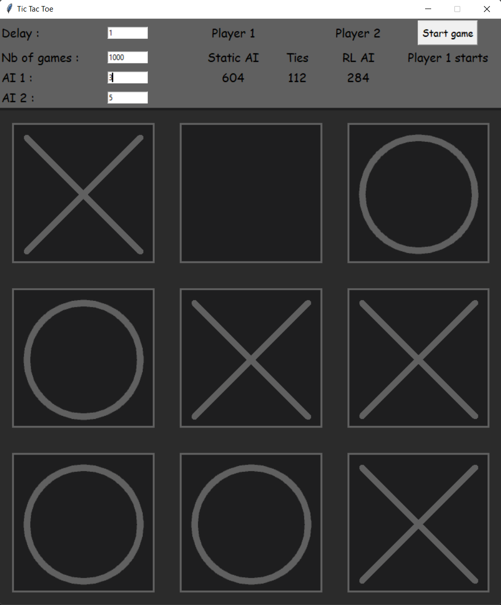

Implementation of multiples tic tac toe AIs to get used to python tkinter and learn about reinforcement learning.

AIs:
- Random
- Static (using cell values, but taking win moves and avoiding loses)
- MiniMax (no depth)
- RL (using https://github.com/MJeremy2017/reinforcement-learning-implementation/blob/master/TicTacToe, but it is really bad : it only stores past games)